<!--- ============================================================ --->
<!---                   S A P A   A P P                           --->
<!---              Sistem Aplikasi Pembayaran Aman                --->
<!--- ============================================================ --->

# 💳 SAPA - Sistem Aplikasi Pembayaran Aman

  

  <strong>Bayar Tagihan • Isi Pulsa • Kelola Keuangan • Semua Jadi Mudah</strong>

  
  
  
  
  

---

> 🚀 **"SAPA - Solusi Pembayaran Digital yang Aman, Cepat, dan Terpercaya"**

---

## 📋 Nama Aplikasi

# 🏷️ **SAPA**
### *Sistem Aplikasi Pembayaran Aman*

Nama **SAPA** dipilih karena memiliki makna mendalam:
- **S**istem - Terstruktur dan terorganisir
- **A**plikasi - Berbasis web modern
- **P**embayaran - Fokus utama layanan
- **A**man - Keamanan dan kenyamanan pengguna

---

## 📖 Deskripsi Singkat

**SAPA** adalah aplikasi web pembayaran digital yang dirancang untuk memudahkan masyarakat Indonesia dalam membayar berbagai tagihan rutin seperti **Listrik (PLN)**, **PDAM**, **Internet**, **Biaya Kuliah/SPP**, serta **Isi Pulsa** dan **Paket Data**. 

Dengan antarmuka yang **intuitif**, **modern**, dan **responsif**, SAPA menghadirkan pengalaman pembayaran digital yang mirip dengan aplikasi populer seperti **Tokopedia**, **DANA**, atau **PLN Mobile**.

### ✨ Keunggulan SAPA
- 🎯 **Simulasi Realistis** - Alur pembayaran mirip aplikasi asli
- 📱 **Mobile-First** - Dioptimalkan untuk pengguna smartphone
- 🌙 **Dark Mode** - Nyaman digunakan di malam hari
- 💾 **Penyimpanan Lokal** - Data tersimpan aman di LocalStorage
- 🖨️ **Cetak & PDF** - Struk pembayaran bisa dicetak atau di-download

### 🎯 Tujuan Pembuatan
Aplikasi ini dikembangkan sebagai tugas **UAS Mata Kuliah Pemrograman 2** dengan fokus pada:
- Perancangan UI/UX yang modern dan responsif
- Pengelolaan state dengan Vanilla JavaScript
- Simulasi alur pembayaran yang realistis
- Penggunaan LocalStorage untuk penyimpanan data
- Penerapan loading state, validasi form, notifikasi, dan bukti transaksi

## 🚀 Cara Menjalankan Aplikasi

### 📋 Prasyarat
| Komponen | Keterangan |
|----------|------------|
| 🌐 Browser | Chrome, Firefox, Edge, Safari (versi terbaru) |
| 📶 Internet | Koneksi internet untuk mengakses CDN |

---

### 🔧 Cara Menjalankan

**Cukup buka file `index.html` di browser Anda!**
📁 SAPA/

├── 📄 index.html ← Klik dua kali file ini

├── 📁 css/

├── 📁 js/

└── 📁 assets/

| No | Langkah | Keterangan |
|----|---------|------------|
| 1 | Buka folder proyek | Cari folder SAPA di komputer Anda |
| 2 | Klik dua kali `index.html` | Akan terbuka di browser default |
| 3 | Aplikasi siap digunakan | 🎉 Selamat mencoba! |

#### Cara Lain:
- Klik kanan `index.html` → **Open With** → Pilih browser
- Drag and drop `index.html` ke jendela browser
- Buka browser → **File** → **Open File** → Pilih `index.html`

---

### ✅ Cek Aplikasi Berjalan
Setelah membuka `index.html`, Anda akan melihat:
- ✅ Halaman **Dashboard** dengan saldo awal Rp5.000.000
- ✅ **Bottom Navigation** untuk navigasi antar halaman
- ✅ **Dark Mode** toggle di pojok kanan atas

> 💡 **Catatan**: Tidak perlu server atau instalasi tambahan. Cukup buka file HTML-nya

## ✅ Daftar Fitur yang Diimplementasikan

### 1. Dashboard / Beranda

| Fitur | Keterangan | Status |
|-------|------------|--------|
| Saldo Simulasi | Menampilkan saldo pengguna | ✅ |
| Quick Access | Tombol cepat ke 6 layanan favorit | ✅ |
| Promo Banner | Slider promo dengan gambar | ✅ |
| Ringkasan | Total transaksi, pengeluaran, sisa saldo | ✅ |
| Aktivitas Terakhir | 5 transaksi terakhir dengan timestamp | ✅ |
| Top Up Saldo | Fitur tambah saldo simulasi | ✅ |

---

### 2. Bayar Tagihan

#### A. Pilihan Layanan

| Layanan | Keterangan |
|---------|------------|
| PLN | Tagihan listrik |
| PDAM | Tagihan air |
| Internet | Tagihan internet |
| Seminar | Tagihan event/seminar |

#### B. Fitur Utama

| Fitur | Keterangan | Status |
|-------|------------|--------|
| Validasi Input | Nomor pelanggan 8-12 digit (hanya angka) | ✅ |
| Loading State | Spinner + skeleton screen | ✅ |
| Detail Tagihan | Nama, alamat, periode, tagihan, denda, jatuh tempo | ✅ |
| 3 Metode Pembayaran | Virtual Account, QRIS, Teller/Kasir | ✅ |

#### C. Virtual Account

| Fitur | Keterangan | Status |
|-------|------------|--------|
| Pilih Bank | BCA, BNI, Mandiri, BRI, CIMB Niaga, Danamon | ✅ |
| Generate VA | Nomor VA unik (8808 + random) | ✅ |
| Instruksi Transfer | Panduan langkah demi langkah | ✅ |
| Copy VA | Salin nomor VA ke clipboard | ✅ |

#### D. QRIS

| Fitur | Keterangan | Status |
|-------|------------|--------|
| Pilih E-Wallet | Gopay, OVO, DANA, LinkAja, ShopeePay | ✅ |
| QR Code | Generate dengan qrcode.js | ✅ |
| Countdown Timer | 5 menit masa berlaku | ✅ |

#### E. Teller / Kasir

| Fitur | Keterangan | Status |
|-------|------------|--------|
| Pilih Lokasi | Indomaret, Alfamart, Kantor SAPA, Pos Indonesia | ✅ |
| Kode Pembayaran | Generate kode unik | ✅ |
| Logo Kasir | Logo PNG setiap lokasi | ✅ |

---

### 3. Biaya Kuliah / SPP

| Fitur | Keterangan | Status |
|-------|------------|--------|
| Input NIM | Validasi 10-12 digit angka | ✅ |
| Daftar Cicilan | 6-8 cicilan per semester | ✅ |
| Checkbox Multi-Select | Pilih beberapa cicilan sekaligus | ✅ |
| Total Otomatis | Total terhitung dari pilihan | ✅ |
| Status Lunas/Belum | Badge status setiap cicilan | ✅ |
| Pilih Semua | Tombol pilih semua yang belum lunas | ✅ |
| Kode Tagihan | Menampilkan kode unik setiap cicilan | ✅ |

---

### 4. Isi Pulsa & Paket Data

| Fitur | Keterangan | Status |
|-------|------------|--------|
| Input Nomor HP | Validasi 10-13 digit, diawali 08 | ✅ |
| Pilih Provider | Telkomsel, Indosat, XL, Tri, Smartfren, Axis | ✅ |
| Logo Provider | PNG setiap provider | ✅ |
| Auto-Detect | Deteksi provider dari nomor HP | ✅ |
| Nominal Pulsa | Rp10.000, Rp25.000, Rp50.000, Rp100.000, Rp200.000 | ✅ |
| Paket Data | Paket populer setiap provider | ✅ |
| Metode Pembayaran | VA, QRIS, Teller | ✅ |

---

### 5. Riwayat Transaksi

| Fitur | Keterangan | Status |
|-------|------------|--------|
| Tabel Riwayat | Semua transaksi tersimpan | ✅ |
| Filter | Semua, PLN, PDAM, SPP, Pulsa | ✅ |
| Statistik Chart | Doughnut chart dengan Chart.js | ✅ |
| Total Pengeluaran | Ringkasan total pengeluaran | ✅ |
| Reset Data | Hapus semua data simulasi | ✅ |

---

### 6. Fitur Pendukung

| Fitur | Keterangan | Status |
|-------|------------|--------|
| Dark Mode | Toggle dark/light mode | ✅ |
| Responsive Design | Mobile-first, tablet, desktop | ✅ |
| Loading State | Spinner overlay & skeleton screen | ✅ |
| Notifikasi | Toast success, error, info | ✅ |
| Modal Konfirmasi | Sebelum proses pembayaran | ✅ |
| Struk Pembayaran | Cetak (window.print) & Download PDF (jsPDF) | ✅ |
| LocalStorage | Penyimpanan data client-side | ✅ |
| Validasi Form | Real-time & on submit | ✅ |
| Animasi Halus | Fade, slide, spin, pulse | ✅ |

## 📸 Screenshot Aplikasi

### Desktop View

| Halaman | Screenshot |
|---------|------------|
| **Dashboard** | 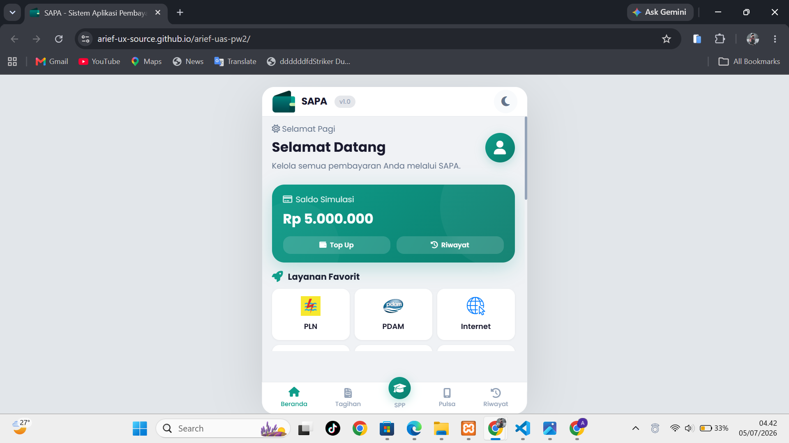 |
| **Bayar Tagihan** | 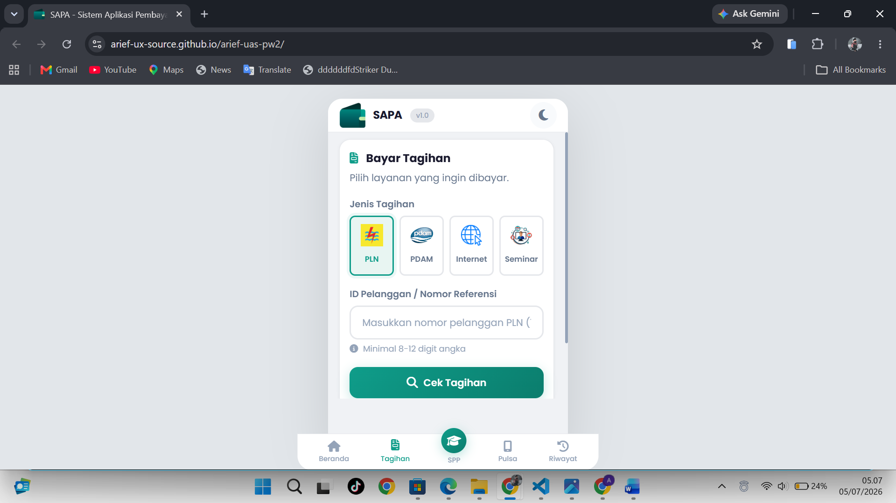 |
| **SPP** | 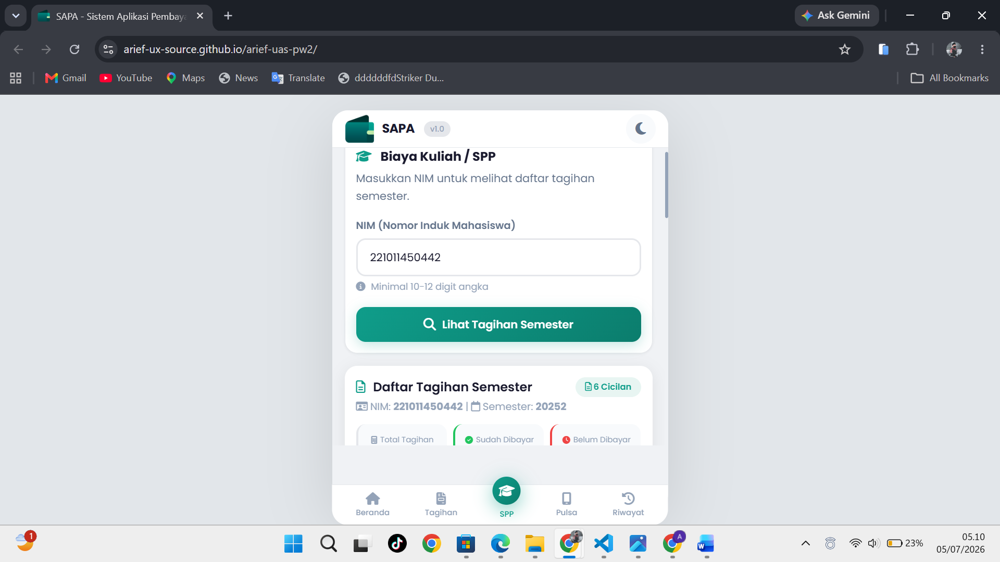 |
| **Pulsa** | 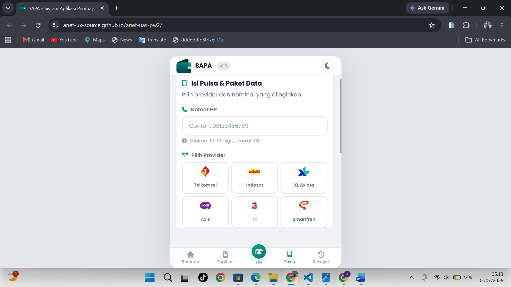 |
| **Riwayat** | 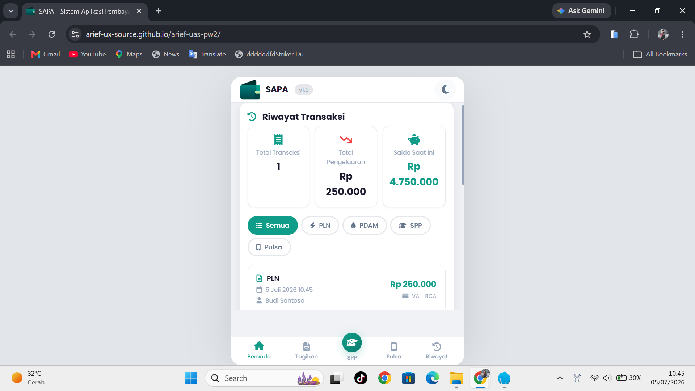 |
| **Mode Malam** | 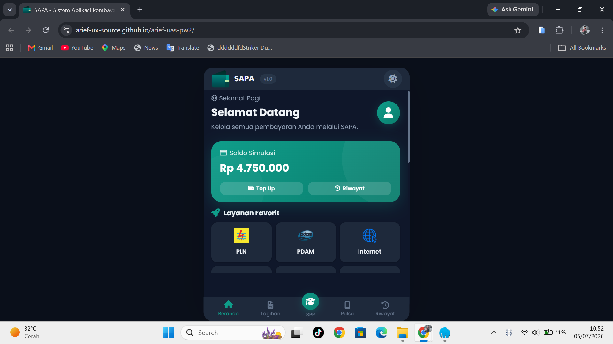 |

---

### Mobile View

| Halaman | Screenshot |
|---------|------------|
| **Dashboard** | 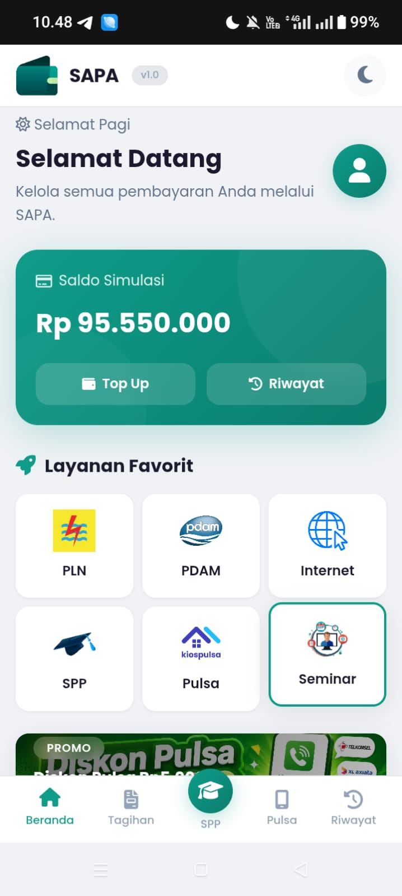 |
| **Bayar Tagihan** | 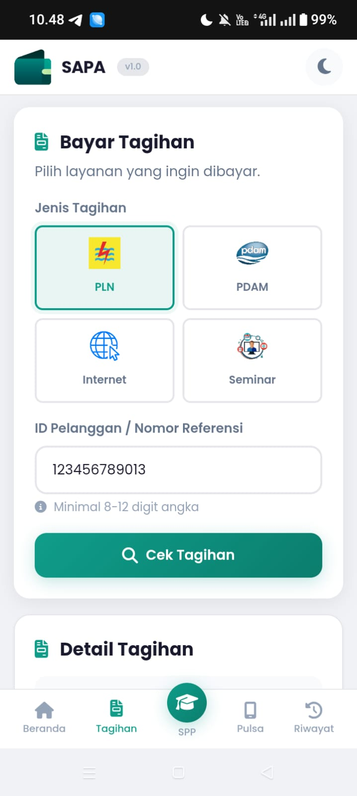 |
| **SPP** | 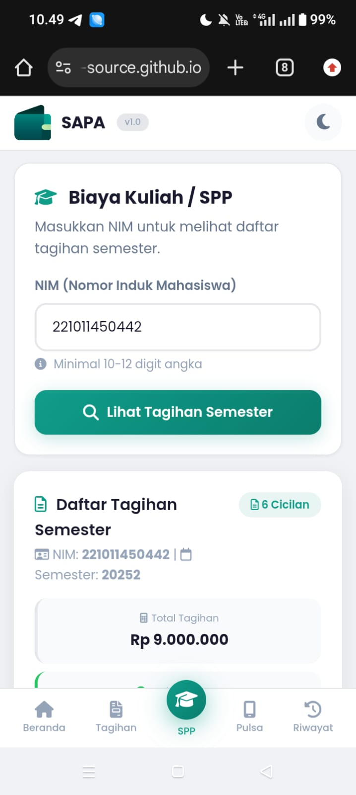 |
| **Pulsa** | 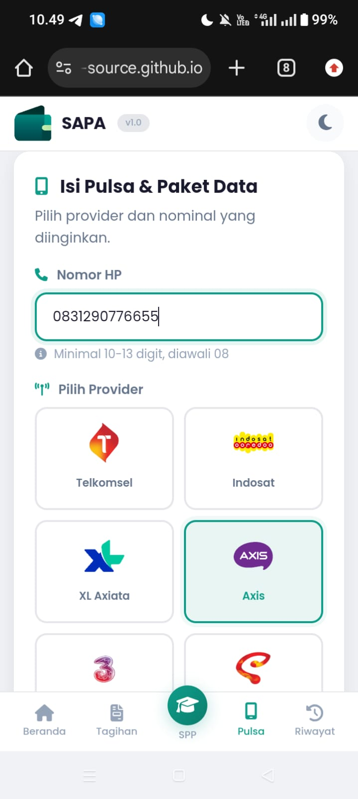 |
| **Riwayat** | 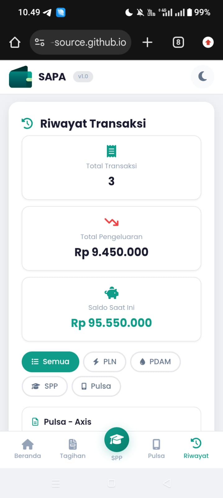 |
| **Mode Malam** | 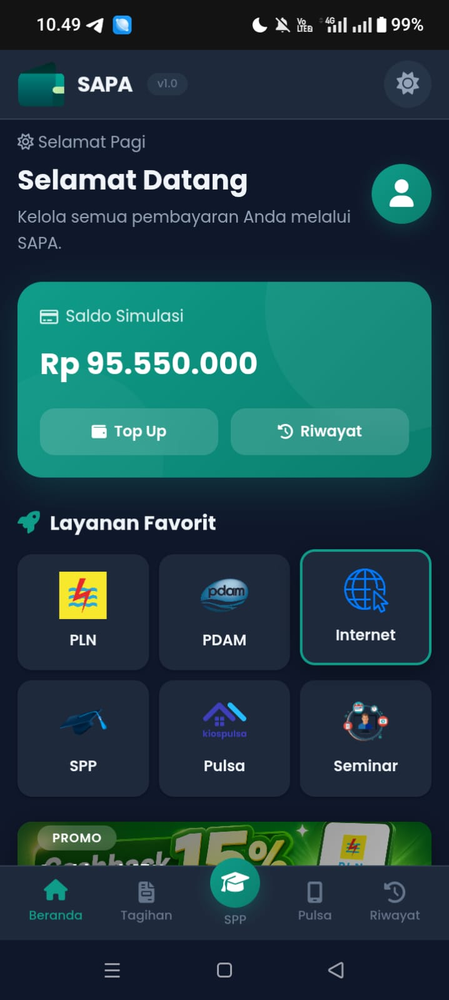|

## 🔗 Link Demo

Aplikasi SAPA dapat diakses secara online melalui platform berikut:

| Platform | Link | Status |
|----------|------|--------|
| 🌐 **GitHub Pages** | [https://arief-ux-source.github.io/arief-uas-pw2/] | ✅ Active |
| 🌐 **Video Turorial** | [https://www.youtube.com/watch?v=9UVgk8uwOvI] | ✅ Active |

---

## 🛠️ Teknologi yang Digunakan

### Frontend
| Teknologi | Versi | Keterangan |
|-----------|-------|------------|
|  | HTML5 | Struktur halaman |
|  | CSS3 | Styling (Flexbox, Grid, Custom Properties) |
|  | ES6+ | Logika aplikasi |

### Library & Tools
| Library | Keterangan |
|---------|------------|
| **Font Awesome 6** | Ikon vektor |
| **QRCode.js** | Generate QR Code |
| **jsPDF** | Export PDF struk |
| **Chart.js** | Visualisasi statistik |

### Penyimpanan
| Teknologi | Keterangan |
|-----------|------------|
| **LocalStorage** | Penyimpanan data client-side |

### Hosting & Deployment
| Platform | Keterangan |
|----------|------------|
| **GitHub Pages** | Hosting statis |

## 📁 Struktur Proyek
SAPA/

│

├── 📄 index.html # Halaman utama (entry point)

├── 📄 README.md # Dokumentasi proyek

│

├── 📁 assets/ # Aset statis

│ ├── 📁 img/

│ │ ├── 📁 services/ # Logo layanan (PLN, PDAM, Internet, SPP, Pulsa, Seminar)

│ │ ├── 📁 providers/ # Logo provider (Telkomsel, Indosat, XL, Tri, Smartfren, Axis)

│ │ ├── 📁 banks/ # Logo bank (BCA, BNI, Mandiri, BRI, CIMB, Danamon)

│ │ ├── 📁 cashier/ # Logo kasir (Indomaret, Alfamart, Kantor SAPA, Pos Indonesia)

│ │ └── 📁 banner/ # Banner promo (promo-1.png, promo-2.png, promo-3.png)

│ └── 📁 icon/ # Favicon & logo aplikasi

│

├── 📁 css/ # Stylesheet

│ ├── 📄 style.css # Gaya global & variabel

│ ├── 📄 dashboard.css # Dashboard

│ ├── 📄 bill.css # Tagihan

│ ├── 📄 spp.css # SPP

│ ├── 📄 pulsa.css # Pulsa

│ ├── 📄 history.css # Riwayat

│ ├── 📄 modal.css # Modal

│ └── 📄 responsive.css # Responsive (mobile-first)

│

└── 📁 js/ # JavaScript

├── 📄 config.js # Konfigurasi aplikasi

├── 📄 storage.js # LocalStorage management

├── 📄 utils.js # Utility functions (format, toast, modal, loading)

├── 📄 data.js # Data simulasi (PLN, PDAM, Internet, Seminar, SPP, Pulsa)

├── 📄 app.js # SPA Router (navigasi utama)

├── 📄 dashboard.js # Dashboard logic

├── 📄 bill.js # Tagihan logic (PLN, PDAM, Internet, Seminar)

├── 📄 spp.js # SPP logic

├── 📄 pulsa.js # Pulsa & Paket Data logic

└── 📄 history.js # Riwayat & Chart logic

## 🧪 Data Testing

### 📋 ID Pelanggan

#### ⚡ PLN (Listrik)
| ID Pelanggan | Nama | Tagihan | Denda | Jatuh Tempo |
|--------------|------|---------|-------|-------------|
| `123456789012` | Budi Santoso | Rp245.000 | Rp5.000 | 10 Juli 2026 |
| `123456789013` | Siti Aisyah | Rp185.000 | Rp0 | 12 Juli 2026 |
| `123456789014` | Andi Saputra | Rp320.000 | Rp10.000 | 15 Juli 2026 |
| `123456789015` | Rina Marlina | Rp275.000 | Rp0 | 17 Juli 2026 |
| `123456789016` | Dewi Lestari | Rp410.000 | Rp15.000 | 20 Juli 2026 |

#### 💧 PDAM (Air)
| ID Pelanggan | Nama | Tagihan | Denda | Jatuh Tempo |
|--------------|------|---------|-------|-------------|
| `555666777888` | Yusuf Hidayat | Rp98.000 | Rp2.000 | 8 Juli 2026 |
| `555666777889` | Nina Oktavia | Rp126.000 | Rp0 | 11 Juli 2026 |
| `555666777890` | Rudi Hartono | Rp87.000 | Rp3.000 | 9 Juli 2026 |

#### 🌐 Internet
| ID Pelanggan | Nama | Layanan | Tagihan | Denda | Jatuh Tempo |
|--------------|------|---------|---------|-------|-------------|
| `111222333444` | Andika Pratama | IndiHome | Rp350.000 | Rp0 | 18 Juli 2026 |
| `111222333445` | Salsabila Putri | Biznet | Rp425.000 | Rp0 | 22 Juli 2026 |
| `111222333446` | Rahmat Hidayat | MyRepublic | Rp389.000 | Rp5.000 | 25 Juli 2026 |

#### 🎫 Seminar
| ID Referensi | Nama Event | Lokasi | Tagihan | Jatuh Tempo |
|--------------|------------|--------|---------|-------------|
| `SEM001` | Seminar Nasional AI 2026 | Universitas Indonesia | Rp150.000 | 15 Juli 2026 |
| `SEM002` | Workshop Cyber Security | Universitas Brawijaya | Rp200.000 | 18 Juli 2026 |
| `SEM003` | Seminar Web Development | Universitas Negeri Jakarta | Rp175.000 | 22 Juli 2026 |

---

### 🎓 NIM untuk SPP
| NIM | Jumlah Cicilan | Semester | Keterangan |
|-----|----------------|----------|------------|
| `221011450442` | 6 cicilan @ Rp1.500.000 | Ganjil 2025/2026 | Semua belum lunas |
| `221011450443` | 6 cicilan @ Rp1.500.000 | Genap 2024/2025 | Beberapa sudah lunas |
| `221011450444` | 2 cicilan @ Rp1.500.000 | Ganjil 2025/2026 | Semua belum lunas |

---

### 📱 Nomor HP untuk Pulsa
| Nomor HP | Provider | Keterangan |
|----------|----------|------------|
| `08123456789` | Telkomsel | Auto-detect by prefix |
| `08151234567` | Indosat | Auto-detect by prefix |
| `08781234567` | XL | Auto-detect by prefix |
| `08961234567` | Tri | Auto-detect by prefix |
| `08811234567` | Smartfren | Auto-detect by prefix |
| `08381234567` | Axis | Auto-detect by prefix |

## 👨‍💻 Tentang Pengembang

### Biodata Singkat
| Data | Keterangan |
|------|------------|
| **Nama** | [ARIEF ALKHOIR] |
| **NIM** | [221011450442] |
| **Kelas** | [07TPLE002] |
| **Semester** | [7] |
| **Mata Kuliah** | Pemrograman Web 2 |
| **Dosen Pengampu** | [Fajar Agung Nugroho, S.Kom., M.Kom.] |

### Kontak
| Platform | Link |
|----------|------|
| 📧 Email | [email@ariefalkhoir157@gmail.com] |

---

---

## 🙏 Ucapan Terima Kasih

Terima kasih kepada semua pihak yang telah membantu dalam pengembangan aplikasi ini:

- 👨‍🏫 **Dosen Pengampu** - Atas bimbingan dan arahan selama perkuliahan
- 👥 **Teman-teman** - Atas masukan, saran, dan dukungannya
- 📚 **Sumber Daya Online** - Dokumentasi, tutorial, dan referensi
- 🎨 **Sumber Aset** - Penyedia logo dan ikon gratis

---

## 📝 Catatan Akhir

> *"Aplikasi ini dibuat sebagai bentuk implementasi ilmu yang telah dipelajari selama perkuliahan. Semoga bermanfaat dan menginspirasi."*

---

  <strong>Create By [Arief-Alkhoir]</strong>

  <strong>© 2026 SAPA - Sistem Aplikasi Pembayaran Aman</strong>

  
  
  

---
